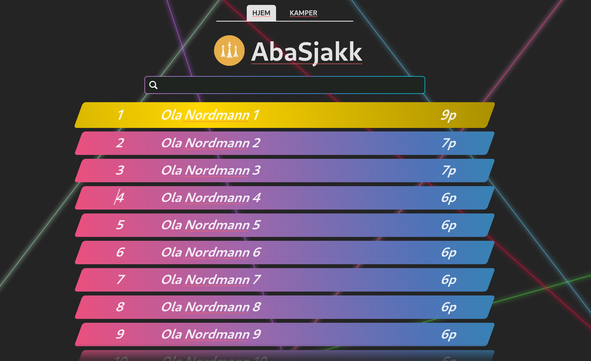

# abasjakk
> En sjakkturneringsnettside for AbaSjakk interessegruppe. Foreløpig er den tematisert for sjakkrave.



## Getting started
```
docker-compose up -d
cd ./server
bun start &
cd ../client
bun dev &
```

Alternativt kan du kjøre hele prosjektet i docker ved å kjøre kommandoen `docker-compose up -d` i `deployment` mappen.
